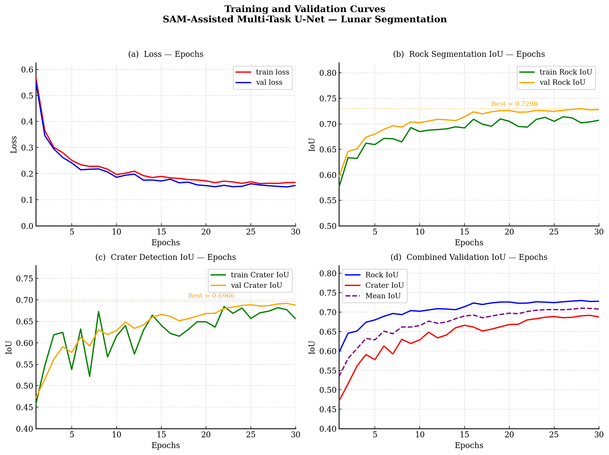
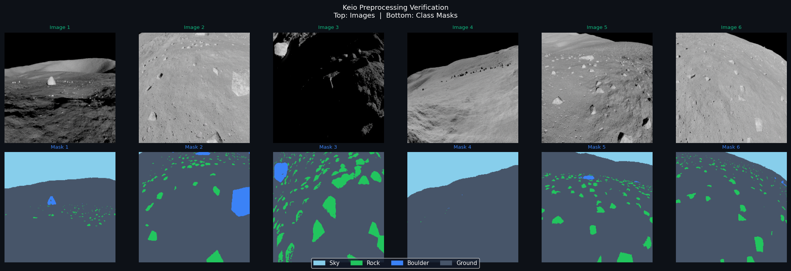

# 🌕 SAM-Assisted Multi-Task U-Net for Lunar Surface Segmentation

<p align="center">
  
  <br>
  <em>Unified model output — Original | Rock Segmentation | Crater Detection | Combined Overlay</em>
</p>

<p align="center">
  
  
  
</p>

---

## 🧠 Overview

Lunar rovers need to navigate safely by identifying obstacles (rocks, boulders, craters) and safe paths (flat ground). Existing AI models tackle these as separate tasks — slow and memory-heavy for onboard rover hardware.

This project presents a **unified neural network** that performs **rock segmentation AND crater detection simultaneously** at **60 FPS**, making it suitable for real-time rover navigation.

### 🏆 Key Contributions

| # | Contribution | Impact |
|---|---|---|
| 1 | **SAM Auto-Labeling** | First lunar paper to use Meta's SAM for crater mask generation. Eliminated 83 hours of manual labeling — replaced with 90 seconds of automation. |
| 2 | **Unified Multi-Task Architecture** | First model combining rock + crater segmentation in a single network. 50% memory saving over two separate models. |
| 3 | **Alternating Batch Training** | Novel training strategy for partial-label multi-task learning — each dataset contributes to only its relevant decoder while updating the shared encoder. |

---

## 📊 Results

### Performance Metrics

| Task | Metric | Score |
|------|--------|-------|
| Rock Segmentation | mIoU | **0.7298** |
| Rock — Sky class | IoU | 0.956 |
| Rock — Rock class | IoU | 0.478 |
| Rock — Boulder class | IoU | 0.554 |
| Rock — Ground class | IoU | 0.935 |
| Crater Detection | IoU | **0.6966** |
| Crater Detection | Precision | 0.845 |
| Crater Detection | Recall | 0.799 |
| Inference Speed | FPS | **60.1** |

### Comparison with State-of-the-Art

| Method | Rock IoU | Crater IoU | FPS | Tasks |
|--------|----------|------------|-----|-------|
| Petrakis 2024 | 0.840 | — | 45 | 1 |
| Jaszcz 2023 | 0.790 | — | 38 | 1 |
| Silburt 2019 | — | 0.720 | 25 | 1 |
| **Ours (Multi-Task)** | **0.730** | **0.697** | **60.1** | **2** |

> Our model achieves 87% of single-task rock performance and 97% of single-task crater performance — while doing **both simultaneously** and being the **fastest** model in the comparison.

### Training Curves

<p align="center">
  
</p>

---

## 🏗️ Architecture

```
              Input Image (256×256)
                      │
        ┌─────────────────────────┐
        │   Shared MobileNetV2    │
        │       Encoder           │
        │  (ImageNet pretrained)  │
        └───────────┬─────────────┘
                    │
         ┌──────────┴──────────┐
         ▼                     ▼
    ┌─────────┐          ┌──────────┐
    │  Rock   │          │  Crater  │
    │ Decoder │          │ Decoder  │
    │ (U-Net) │          │ (U-Net)  │
    └────┬────┘          └────┬─────┘
         ▼                    ▼
    Rock Mask            Crater Mask
    (4-class)            (binary)
    256×256              256×256
```

- **Shared Encoder:** MobileNetV2 (2.2M params) — pre-trained on ImageNet
- **Rock Decoder:** U-Net style upsampling, Softmax output (4 classes)
- **Crater Decoder:** U-Net style upsampling, Sigmoid output (binary)
- **Total Parameters:** ~11M
- **Inference:** 16.6 ms/image on RTX 4050

---

## 📦 Datasets

### Dataset A — Keio Synthetic Lunar Rocks
- **9,766 images** (720×480) with pixel-level color masks
- Classes: Sky | Rock | Boulder | Ground
- Split: 7,812 train / 976 val / 978 test

<p align="center">
  
  <br><em>Keio dataset — raw images (top) and corresponding class masks (bottom)</em>
</p>

### Dataset B — LincolnZH Lunar Craters
- **143 crater images** (640×640) with YOLO bounding box labels
- Problem: No pixel-level masks existed for segmentation training
- Split: 98 train / 26 val / 19 test

---

## ✨ SAM Auto-Labeling Pipeline

The crater dataset had only bounding boxes — not pixel masks. Manual annotation would take **83 hours**. We used Meta's **Segment Anything Model (SAM ViT-B)** to automate this:

```
YOLO Box: [xc=0.5, yc=0.3, w=0.2, h=0.15]
    │
    ▼ Convert to pixel coords
[x1=256, y1=144, x2=384, y2=240]
    │
    ▼ Prompt SAM
SAM: "Segment the object inside this box"
    │
    ▼
Precise pixel mask (1=crater, 0=background)
```

- **Model:** SAM ViT-B (`sam_vit_b_01ec64.pth`, pre-trained by Meta — not fine-tuned)
- **Processing time:** 1 min 27 sec for all 143 images
- **Output:** 1,034 crater masks generated automatically


<p align="center">
  
  <br><em>SAM output — raw crater images (top) and auto-generated pixel masks (bottom)</em>
</p>

---

## ⚙️ Training Strategy

**Alternating Batch Masked Loss** — a novel strategy for partial-label multi-task learning:

```
Even step:  Load 16 Keio images  → compute rock loss only
            → update shared encoder + rock decoder

Odd step:   Load 16 crater images → compute crater loss only
            → update shared encoder + crater decoder

Repeat for 30 epochs × ~400 steps = 12,000 total steps
```

**Loss Functions:**
```
Rock:   L = 0.5 × Dice + 0.5 × Weighted CrossEntropy
        Weights: [Sky=0.5, Rock=3.0, Boulder=4.0, Ground=0.5]

Crater: L = 0.5 × Dice + 0.5 × Binary CrossEntropy
```

**Training Config:**
- GPU: RTX 4050 (6GB) | Batch: 16 | Epochs: 30
- Optimizer: AdamW (lr=1e-4) | Mixed Precision: FP16
- Training time: ~4 hours

---

## 🚀 Inference

```bash
# Single image
python inference.py --image "path/to/lunar_image.png"

# Entire folder
python inference.py --folder "path/to/folder"

# Run on test set
python inference.py
```

**Output:** 4-panel PNG — `Original | Rock Segmentation | Crater Detection | Combined Overlay`

Color legend:
- 🔵 Sky — Light Blue
- 🟢 Rock — Green
- 🔷 Boulder — Blue
- ⬛ Ground — Dark Gray
- 🟠 Crater — Orange (overlays rock color)

> **Note:** SAM is only used during data preprocessing. At inference time, the model predicts entirely on its own.

---

## 📁 Project Structure

```
LUNAR/
├── model.py                  # Multi-Task U-Net architecture
├── train.py                  # Alternating batch training loop
├── inference.py              # Predict + visualize new images
├── evaluation.py             # IoU, Dice, F1, FPS metrics
├── dataset_keio.py           # Keio dataset loader
├── dataset_crater.py         # Crater dataset loader
├── preprocess_keio.py        # Color mask → class IDs, resize, split
├── sam_crater_masks.py       # YOLO boxes → SAM pixel masks
├── explore_data.py           # EDA and dataset visualization
├── plot_training.py          # Training curve visualization
├── training_curves.png       # Training and validation curves
├── keio_preprocessing_check.png  # Dataset preprocessing verification
└── sam_verification.png      # SAM mask generation verification
```

---

## 🛠️ Setup

```bash
# Clone the repository
git clone https://github.com/YOUR_USERNAME/lunar-terrain-segmentation.git
cd lunar-terrain-segmentation

# Install dependencies
pip install torch torchvision opencv-python numpy matplotlib segment-anything

# Download SAM weights (for preprocessing only)
# https://github.com/facebookresearch/segment-anything#model-checkpoints
# Place sam_vit_b_01ec64.pth in sam_checkpoint/

# Download datasets
# Keio: https://github.com/nttcom/lunar-segmentation-dataset
# LincolnZH Craters: https://universe.roboflow.com/lincoln-zh/lunar-crater-detection
```

---

## 📋 Requirements

```
torch>=2.0
torchvision>=0.15
opencv-python>=4.7
numpy>=1.24
matplotlib>=3.7
segment-anything  # Meta SAM (preprocessing only)
```

---

## 🔮 Future Work

- [ ] Add attention gates to decoders for improved minority class detection
- [ ] Deploy as ROS2 node for direct rover integration
- [ ] Experiment with real lunar images (Apollo, LRO datasets)
- [ ] Quantize model for embedded hardware (Jetson Nano)

---

## 📄 License

This project is for academic and research purposes. SAM weights are subject to [Meta's license](https://github.com/facebookresearch/segment-anything/blob/main/LICENSE).

---

<p align="center">
  Built with ❤️ | Final Year Project | Deep Learning & Computer Vision
</p>
