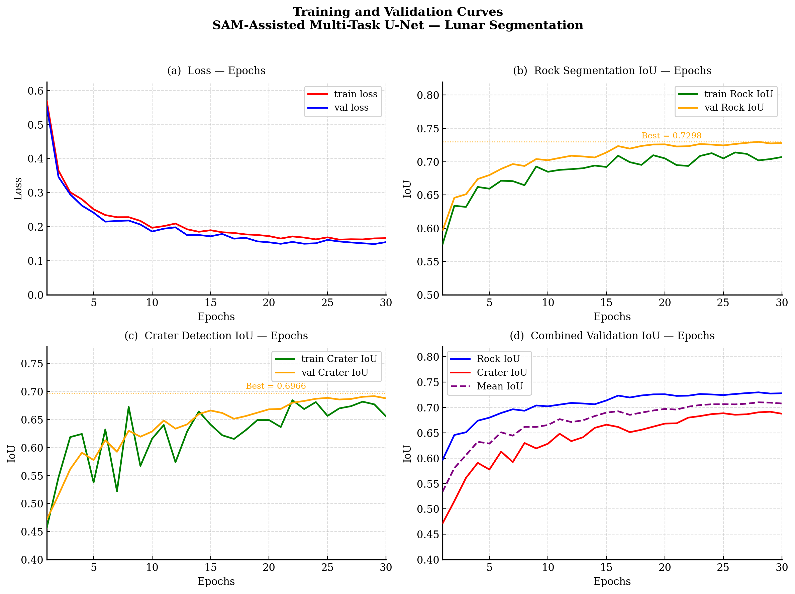
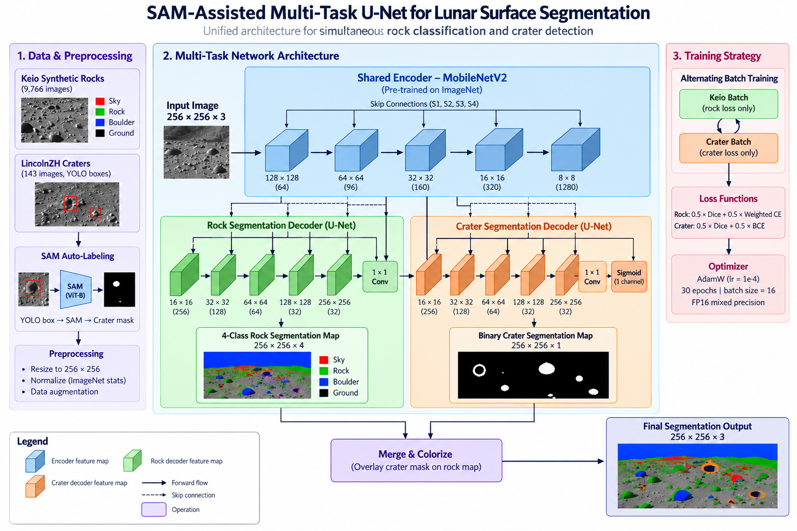
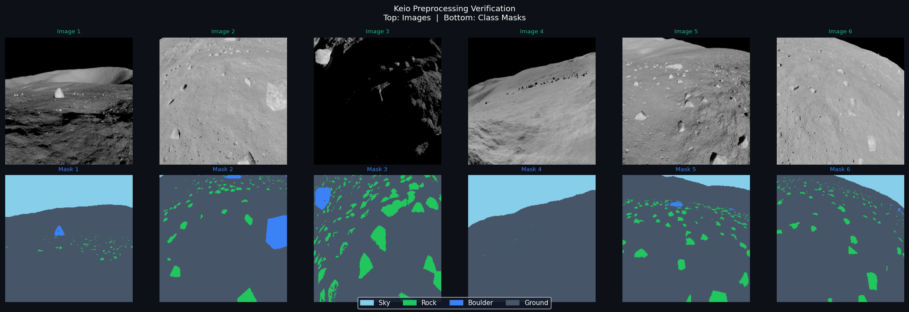

# 🌕 SAM-Assisted Multi-Task U-Net for Lunar Surface Segmentation

<p align="center">
  
  <br>
  <em>Unified model output — Original | Rock Segmentation | Crater Detection | Combined Overlay</em>
</p>

<p align="center">
  
  
  
</p>

---

## 🧠 Overview

Lunar rovers need to navigate safely by identifying obstacles (rocks, boulders, craters) and safe paths (flat ground). Existing AI models tackle these as separate tasks — slow and memory-heavy for onboard rover hardware.

This project presents a **unified neural network** that performs **rock segmentation AND crater detection simultaneously** at **60 FPS**, making it suitable for real-time rover navigation.

### 🏆 Key Contributions

| # | Contribution                        | Impact                                                                                                                                             |
| - | ----------------------------------- | -------------------------------------------------------------------------------------------------------------------------------------------------- |
| 1 | **SAM Auto-Labeling**               | Used Meta's SAM to generate crater pixel masks from bounding-box labels, avoiding fully manual pixel annotation for the crater dataset.            |
| 2 | **Unified Multi-Task Architecture** | Combines rock + crater segmentation in a single network with a shared feature extractor and task-specific decoders.                                |
| 3 | **Alternating Batch Training**      | Training strategy for partial-label multi-task learning — each dataset contributes to only its relevant decoder while updating the shared encoder. |

---

## 📊 Results

### Performance Metrics

| Task                 | Metric    | Score      |
| -------------------- | --------- | ---------- |
| Rock Segmentation    | mIoU      | **0.7298** |
| Rock — Sky class     | IoU       | 0.956      |
| Rock — Rock class    | IoU       | 0.478      |
| Rock — Boulder class | IoU       | 0.554      |
| Rock — Ground class  | IoU       | 0.935      |
| Crater Detection     | IoU       | **0.6966** |
| Crater Detection     | Precision | 0.845      |
| Crater Detection     | Recall    | 0.799      |
| Inference Speed      | FPS       | **60.1**   |

### Comparison with State-of-the-Art

| Method                | Rock IoU  | Crater IoU | FPS      | Tasks |
| --------------------- | --------- | ---------- | -------- | ----- |
| Petrakis 2024         | 0.840     | —          | 45       | 1     |
| Jaszcz 2023           | 0.790     | —          | 38       | 1     |
| Silburt 2019          | —         | 0.720      | 25       | 1     |
| **Ours (Multi-Task)** | **0.730** | **0.697**  | **60.1** | **2** |

<p align="center">
  
</p>

> Our model achieves 87% of single-task rock performance and 97% of single-task crater performance — while performing **both tasks simultaneously** at **60.1 FPS**.

### Training Curves

<p align="center">
  
</p>

---

## 🏗️ Architecture

The proposed architecture combines a **shared MobileNetV2 encoder** with two independent **U-Net-style task-specific decoders**.

The encoder extracts hierarchical visual features from the lunar image. These features are passed to both decoders through U-Net-style skip connections, allowing each task to recover fine spatial information during upsampling.

### 🔬 Detailed Network Architecture

<p align="center">
  
  <br>
  <em>Detailed architecture of the proposed SAM-assisted multi-task U-Net showing the shared MobileNetV2 encoder, U-Net decoders, skip connections, task-specific outputs, and SAM-assisted crater mask generation pipeline.</em>
</p>

### Architecture Flow

```text
Input Image
    │
    ▼
MobileNetV2 Shared Encoder
    │
    ├───────────────┐
    │               │
    ▼               ▼
Rock U-Net      Crater U-Net
Decoder         Decoder
    │               │
    ▼               ▼
4-Class Rock    Binary Crater
Segmentation    Segmentation
    │               │
    └───────┬───────┘
            ▼
     Merge & Colorize
            │
            ▼
    Combined Output
```

### 🔹 Shared MobileNetV2 Encoder

The encoder acts as the common feature extractor for both segmentation tasks.

* **Architecture:** MobileNetV2
* **Pre-training:** ImageNet
* **Input:** `256 × 256 × 3`
* **Bottleneck:** `8 × 8 × 1280`
* **Parameters:** ~2.2M
* Extracts hierarchical features at multiple spatial resolutions
* Encoder feature maps are reused as **skip connections** by both decoders

The encoder progressively reduces spatial resolution while increasing feature depth:

```text
256 × 256 × 3
       ↓
128 × 128
       ↓
64 × 64
       ↓
32 × 32
       ↓
16 × 16
       ↓
8 × 8 × 1280
```

This allows the network to capture both low-level spatial information and high-level semantic features.

### 🔹 Rock Segmentation Decoder

The rock decoder follows a **U-Net-style upsampling architecture**.

It receives the shared bottleneck feature map and progressively reconstructs the original spatial resolution using:

* Upsampling
* Convolutional blocks
* Encoder skip connections
* Final `1 × 1` convolution
* Softmax activation

The output contains four semantic classes:

```text
Sky
Rock
Boulder
Ground
```

Final output:

```text
256 × 256 × 4
```

### 🔹 Crater Segmentation Decoder

The crater decoder follows the same U-Net-style reconstruction principle but has its own task-specific parameters.

It uses:

* Upsampling
* Convolutional blocks
* Encoder skip connections
* Final `1 × 1` convolution
* Sigmoid activation

Final output:

```text
256 × 256 × 1
```

Each pixel represents:

```text
0 → Background
1 → Crater
```

### 🔗 Why Two Decoders?

Although both tasks operate on the same lunar image, they require different semantic representations.

The **shared encoder** learns common visual features such as:

* Surface texture
* Edges
* Illumination patterns
* Terrain structures

The task-specific decoders then specialize these features for:

* **Rock decoder:** semantic classification of sky, ground, rocks and boulders
* **Crater decoder:** binary crater segmentation

This creates a single unified model instead of maintaining two independent networks.

### 📐 Model Summary

| Component         | Architecture         | Output          |
| ----------------- | -------------------- | --------------- |
| Input             | RGB Lunar Image      | `256 × 256 × 3` |
| Shared Encoder    | MobileNetV2          | `8 × 8 × 1280`  |
| Rock Decoder      | U-Net Style          | `256 × 256 × 4` |
| Rock Activation   | Softmax              | 4 classes       |
| Crater Decoder    | U-Net Style          | `256 × 256 × 1` |
| Crater Activation | Sigmoid              | Binary mask     |
| Total Parameters  | Encoder + 2 Decoders | ~11M            |

---

## 📦 Datasets

### Dataset A — Keio Synthetic Lunar Rocks

* **9,766 images** (`720 × 480`)
* Pixel-level color masks
* Classes:

  * Sky
  * Rock
  * Boulder
  * Ground
* Split:

  * 7,812 train
  * 976 validation
  * 978 test

<p align="center">
  
  <br>
  <em>Keio dataset — raw images (top) and corresponding class masks (bottom)</em>
</p>

### Dataset B — LincolnZH Lunar Craters

* **143 crater images** (`640 × 640`)
* YOLO bounding-box annotations
* No pixel-level segmentation masks
* Split:

  * 98 train
  * 26 validation
  * 19 test

---

## ✨ SAM Auto-Labeling Pipeline

The crater dataset originally contained bounding boxes rather than pixel-level masks.

Instead of manually creating segmentation masks, **Segment Anything Model (SAM)** was used to generate crater masks automatically.

```text
YOLO Bounding Box
       │
       ▼
Convert to Pixel Coordinates
       │
       ▼
SAM ViT-B
       │
       ▼
Pixel-Level Crater Mask
       │
       ▼
Training Dataset
```

Example:

```text
YOLO Box:
[xc=0.5, yc=0.3, w=0.2, h=0.15]

        ↓

Pixel Coordinates:
[x1=256, y1=144, x2=384, y2=240]

        ↓

SAM Prompt:
"Segment the object inside this box"

        ↓

Binary Crater Mask:
1 = crater
0 = background
```

### SAM Configuration

* **Model:** SAM ViT-B
* **Checkpoint:** `sam_vit_b_01ec64.pth`
* **Pre-trained by:** Meta
* **Fine-tuning:** None
* **Purpose:** Data preprocessing / auto-labeling only
* **Processing time:** ~1 min 27 sec for 143 images
* **Generated masks:** 143 crater masks

<p align="center">
  
  <br>
  <em>SAM output — raw crater images (top) and auto-generated pixel masks (bottom)</em>
</p>

> **Important:** SAM is not part of the final inference architecture. It is used only during dataset preparation to convert crater bounding boxes into segmentation masks.

---

## ⚙️ Training Strategy

### Alternating Batch Masked Loss

The two datasets contain different types of annotations:

```text
Keio Dataset
    └── Rock labels

LincolnZH Dataset
    └── Crater labels
```

Therefore, both losses cannot be calculated on every image.

The training process alternates between the two datasets:

```text
Even Step
    │
    ▼
Keio Batch
    │
    ▼
Rock Loss Only
    │
    ▼
Shared Encoder + Rock Decoder
```

```text
Odd Step
    │
    ▼
Crater Batch
    │
    ▼
Crater Loss Only
    │
    ▼
Shared Encoder + Crater Decoder
```

This allows the shared encoder to learn from both datasets while each decoder receives supervision only from the dataset containing its corresponding labels.

### Loss Functions

#### Rock Segmentation

```text
L_rock =
0.5 × Dice Loss
+
0.5 × Weighted Cross Entropy
```

Class weights:

```text
Sky      = 0.5
Rock     = 3.0
Boulder  = 4.0
Ground   = 0.5
```

Higher weights are assigned to the minority classes to reduce class imbalance.

#### Crater Segmentation

```text
L_crater =
0.5 × Dice Loss
+
0.5 × Binary Cross Entropy
```

### Training Configuration

| Parameter        | Value                |
| ---------------- | -------------------- |
| GPU              | RTX 4050 6GB         |
| Batch Size       | 16                   |
| Epochs           | 30                   |
| Optimizer        | AdamW                |
| Learning Rate    | `1e-4`               |
| Precision        | FP16 Mixed Precision |
| Training Time    | ~4 hours             |
| Total Parameters | ~11M                 |

---

## 🚀 Inference

The final trained model does **not require SAM** during inference.

```bash
# Single image
python inference.py --image "path/to/lunar_image.png"

# Entire folder
python inference.py --folder "path/to/folder"

# Run on test set
python inference.py
```

### Inference Pipeline

```text
Lunar Image
     │
     ▼
Resize + Normalize
     │
     ▼
Shared MobileNetV2 Encoder
     │
     ├───────────────┐
     ▼               ▼
Rock Decoder     Crater Decoder
     │               │
     ▼               ▼
Softmax           Sigmoid
     │               │
     ▼               ▼
Rock Mask        Crater Mask
     │               │
     └───────┬───────┘
             ▼
       Merge + Colorize
             │
             ▼
      Combined Output
```

### Output

The inference script produces a four-panel visualization:

```text
Original
   │
   ├── Rock Segmentation
   │
   ├── Crater Detection
   │
   └── Combined Overlay
```

### Color Legend

* 🔵 **Sky** — Light Blue
* 🟢 **Rock** — Green
* 🔷 **Boulder** — Blue
* ⬛ **Ground** — Dark Gray
* 🟠 **Crater** — Orange

> **Note:** SAM is only used during data preprocessing. At inference time, the trained multi-task network predicts the rock and crater masks independently.

---

## 📁 Project Structure

```text
LUNAR/
├── model.py                     # Multi-Task U-Net architecture
├── train.py                     # Alternating batch training loop
├── inference.py                 # Predict + visualize new images
├── evaluation.py                # IoU, Dice, F1, FPS metrics
│
├── dataset_keio.py              # Keio dataset loader
├── dataset_crater.py            # Crater dataset loader
│
├── preprocess_keio.py           # Color mask → class IDs, resize, split
├── sam_crater_masks.py          # YOLO boxes → SAM pixel masks
├── explore_data.py              # EDA and dataset visualization
│
├── plot_training.py             # Training curve visualization
├── training_curves.png          # Training and validation curves
├── lunar_architecture.png       # Detailed model architecture
├── keio_preprocessing_check.png # Dataset preprocessing verification
└── sam_verification.png         # SAM mask generation verification
```

---

## 🛠️ Setup

```bash
# Clone the repository
git clone https://github.com/YOUR_USERNAME/lunar-terrain-segmentation.git
cd lunar-terrain-segmentation

# Install dependencies
pip install torch torchvision opencv-python numpy matplotlib segment-anything

# Download SAM weights (for preprocessing only)
# https://github.com/facebookresearch/segment-anything#model-checkpoints

# Place the checkpoint in:
# sam_checkpoint/sam_vit_b_01ec64.pth

# Download datasets
# Keio:
# https://github.com/nttcom/lunar-segmentation-dataset

# LincolnZH Craters:
# https://universe.roboflow.com/lincoln-zh/lunar-crater-detection
```

---

## 📋 Requirements

```text
torch>=2.0
torchvision>=0.15
opencv-python>=4.7
numpy>=1.24
matplotlib>=3.7
segment-anything
```

---

## 🔮 Future Work

* [ ] Add attention gates to decoders for improved minority class detection
* [ ] Deploy as ROS2 node for direct rover integration
* [ ] Experiment with real lunar images from Apollo and LRO datasets
* [ ] Quantize model for embedded hardware such as Jetson Nano
* [ ] Explore additional lightweight encoders for rover deployment
* [ ] Investigate joint optimization strategies for stronger multi-task feature sharing

---

## 📄 License

This project is for academic and research purposes. SAM weights are subject to [Meta's license](https://github.com/facebookresearch/segment-anything/blob/main/LICENSE).

---

<p align="center">
  Built with ❤️ | Final Year Project | Deep Learning & Computer Vision
</p>
